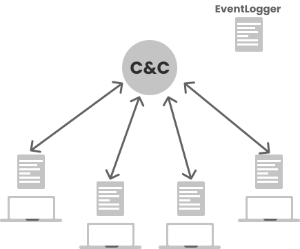
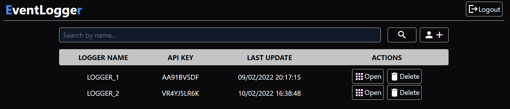
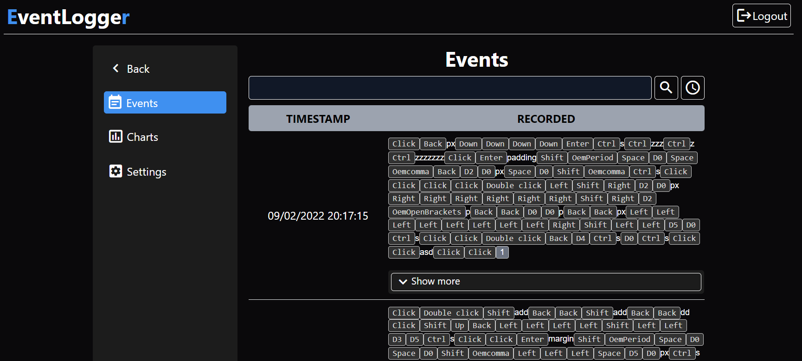
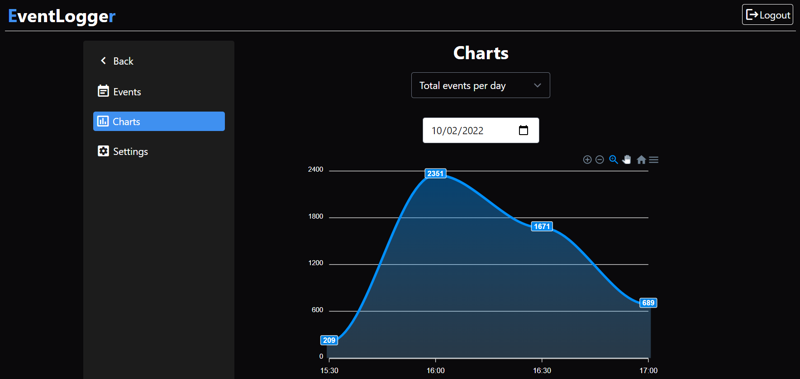
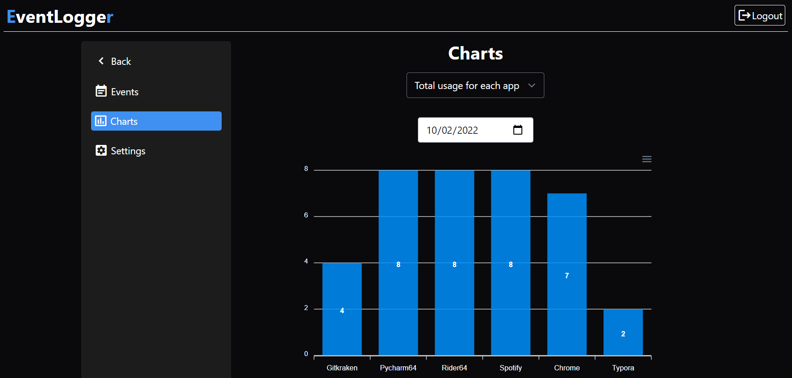
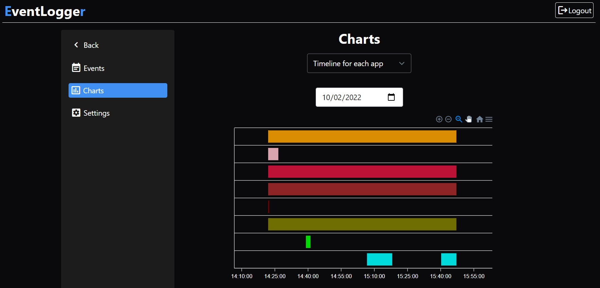
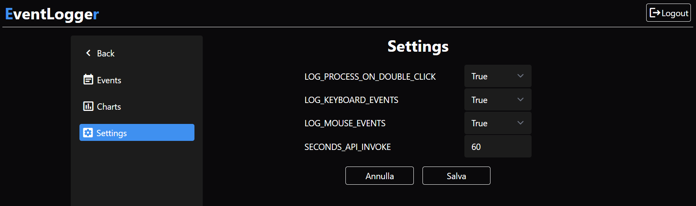

# EventLogger for Windows

The project is composed of two parts:
- `EventLogger`: a [C#](https://docs.microsoft.com/it-it/dotnet/csharp/) script that logs mouse, keyboard and process events and sends them to 
  the command and control server.
- `C&C Server`: the command and control web-server written [Python 3](https://www.python.org/about/).



## EventLogger

The **EventLogger** use the [Windows API](https://docs.microsoft.com/en-us/windows/win32/api/) to log events. It logs the following events:
- *Mouse events*: MouseClick and MouseDoubleClick only
- *Keyboard events*: using the Windows key enumeration format (see [here](https://docs.microsoft.com/en-us/dotnet/api/system.windows.forms.keys?redirectedfrom=MSDN&view=windowsdesktop-6.0))
- *Process events*: using the process name and the timestamp.

The logger has three main components:

- **Constants**: a class with the constants used by the logger.
- **Logger**: a class that implements the logging functionality.
- **EventLogger**: a class that implements the main functionality of the logger.

The **Constants** class isn't very interesting, it contains just the constants used by the logger including the dynamic settings that can be changed in the C&C Server.

The **Logger** implements the logging functionality, including the creation of the log file. The logger stores all the events in a string variable called `_line` and periodically clears it to avoid memory overflow. There are two conditions to clear the `_line` variable:

- reaching the maximum size of events: in this case the Logger class saves the events in a file.
- use the C&C Server api to send the events to the server.

The **EventLogger** class that is the main class. After setting up the methods that catch the events, it starts a thread that every `SECONDS_API_INVOKE` (a dynamic setting) calls the server api to send the events. There are four dynamic settings:
```C#
public int SECONDS_API_INVOKE = 60;
public bool LOG_PROCESS_ON_DOUBLE_CLICK = true;
public bool LOG_MOUSE_EVENTS = true;
public bool LOG_KEYBOARD_EVENTS = true;
```
###### Thread that periodically calls the C&C server api

```C#
try{
    while (true){
        Thread.Sleep(config.SECONDS_API_INVOKE * 1000);
        logger.SendLog();
    }
}
catch (Exception ex){
    Console.WriteLine(ex);
}
```

- `LOG_PROCESS_ON_DOUBLE_CLICK`: if true, the EventLogger logs the process name and the timestamp after a double click event.
- `LOG_MOUSE_EVENTS`: if true, the EventLogger logs the mouse events.
- `LOG_KEYBOARD_EVENTS`: if true, the EventLogger logs the keyboard events.
- `SECONDS_API_INVOKE`: the time in seconds between two invocations of the api.

## C&C Server
The **C&C Server** is a web-server written in Python 3 using the [Django](https://www.djangoproject.com/) framework, using SQLite as the database. There are two apps, one for the UI interface and the other for the EventLogger api. In the `EventLogger` section there is the api to receive the events from the various scripts and convert every single event to a format compatible for the UI interface.
The UI interface helps to manage many `EventLogger` instances, each one with its own settings. The interface basically allow the attacker to:

- Create new `EventLogger` instances
- View the events captured by the instance
- View some graphs of the events
- Change the dynamic settings a specific `EventLogger` instance

### Homepage
Here are all the `EventLogger` instances, for each one there is a link to the app where it is possible to view the events, the graphs and change the dynamic settings.
<center>
	
</center>
### Events view
These are all the events of the `EventLogger`, the events are sorted by timestamp. It is also possible to see the processes captured in a record. 
<center>
	
</center>
### Chart view
All charts are useful to observe the victims' behavior. The charts are:
- **Total usage for each app**: the total usage of each app.
<center>
	 
</center>
- **Total events per day**: all captured events in a day, grouped by app and sorted by timestamp.
<center>
	
</center>
- **Timeline for each app**: the graph shows the apps' usage timeline.
<center>
	
</center>

### Dynamic settings
Here there are all the dynamic settings of the `EventLogger`. Already described in the previous section.
<center>
	
</center>
### Hypothetical Cyber Kill Chain attack

- **Reconnaissance**: Before the attack on the victim the attacker needs to know some information about the network of the victim. For example, if the victim network isn't in the same subnet of the C&C server, the attacker have to set a public IP address for the server.
  
- **Weaponization**: this project don't use any vulnerabilities to attack the victims.

- **Deliver**: an idea to deliver the script is using a USB stick, and then upload the script to the victim.

- **Exploitation**: the script don't use any vulnerabilities to attack the victims.

- **Installation**: typically the attack is based on the physical access to the victim's machine, so the attacker have to:
  - Plug the USB stick to the victim's machine
  - Run the `EventLogger` script in the victim machine
  - Add the `EventLogger` as a system service. This way the script is executed every time the victim machine is booted. After every reboot the dynamic settings are set to default values of the compiled script; They will be synchronized with the C&C server only after the first api call.
  
- **Command and control channel**: the channel between the C&C server and the script is based on HTTP. The script periodically sends an HTTP request to the C&C server where on the body there are the events captured then C&C server sends back as response the dynamic settings.
  
  ###### HTTP POST send by the script

  ```json
  {
      "key": "EVENTLOGGER_KEY",
      "content": "EVENTLOGGER_EVENTS"
  }
  ```
  
  ###### Response from the C&C server

  ```json
  {
      "LOG_PROCESS_ON_DOUBLE_CLICK": true,
      "LOG_KEYBOARD_EVENTS": true,
      "LOG_MOUSE_EVENTS": true,
      "SECONDS_API_INVOKE": 30
  }
  ```
  
- **Action and objectives**: all the information captured by the script are stored in the C&C server, the attacker can look up the information by using the `events` or the `graph` section available in the C&C server UI.
### Server installation
Open the folder 'Server' and install the requirements.txt file:
```bash
pip install -r requirements.txt
```
Apply the database migration running the following command:
```bash
python manage.py migrate
```
Now you have to create a superuser to access the admin interface:
```bash
python manage.py createsuperuser
# follow the instructions to create the superuser
```
After that, you can access the admin interface that by default is at `http:localhost:8000`:
```bash
python manage.py runserver
```

### Conclusion
The `EventLogger` is a script that helps to observe the behavior of the victims. The `C&C server` is a web-interface that helps to manage many `EventLogger` instances, each one with its own settings. This project is a prototype, it is not meant to be used for malicious purposes.
Stack used:
- C# [scripting language](https://docs.microsoft.com/en-us/dotnet/csharp/)
- Python [Django framework](https://www.djangoproject.com/)
- Javascript with [JQuery](https://jquery.com/) and [ApexCharts](https://apexcharts.com/) (chart library)
- Tailwind [CSS framework](https://tailwindcss.com/)
- SQLite [database](https://www.sqlite.org/)


The repository is available at [GitHub](https://github.com/nicofretti/EventLogger).
